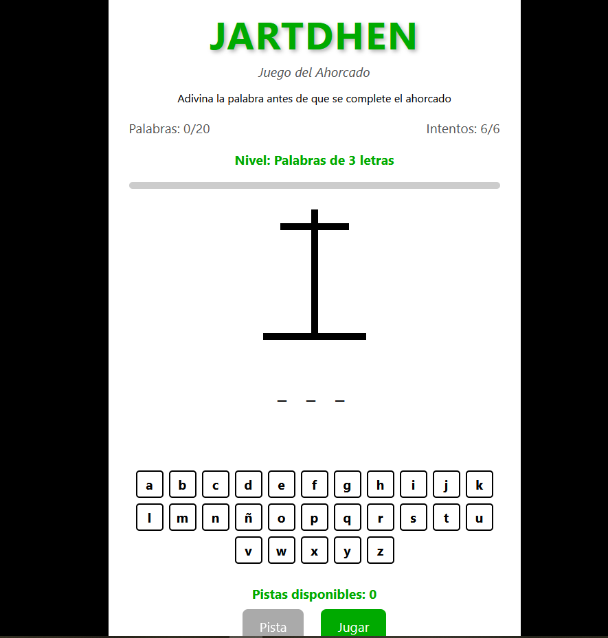

# 🎮 JARTDHEN - Juego del Ahorcado

Un **juego del ahorcado** con diseño moderno y niveles progresivos, desarrollado con **JavaScript, HTML y CSS**.  
Disfrutá del clásico juego de adivinar palabras con un **toque visual atractivo** y **mecánicas mejoradas**.

## 🚀 Demo

## 📸 Captura de Pantalla

## 🛠️ Tecnologías usadas
- **HTML5**
- **CSS3**
- **JavaScript Vanilla**

## ✨ Características
- 🎨 **Diseño moderno** con interfaz limpia y atractiva  
- 📈 **Sistema de niveles progresivos** (palabras de 3 a 9+ letras)  
- 💡 **Sistema de pistas** que se ganan cada 5 palabras acertadas  
- 📊 **Barra de progreso** para visualizar el avance  
- ⌨️ **Compatibilidad** con teclado físico y virtual  
- 📱 **Responsive** para dispositivos móviles  

## 📂 Estructura del proyecto
### jartdhen/
### │── index.html
### │── css/
### ├── └── style.css 
### │── js/
### ├── └── script.js
### ├── assets/ (Imágenes, iconos SVG)  
### └── README.md  

## 🎯 ¿Cómo jugar?
1. El objetivo es adivinar la palabra letra por letra antes de que se complete el dibujo del ahorcado.  
2. Haz clic en las letras que crees que están en la palabra.  
3. Cada error suma un intento fallido y avanza el dibujo.  
4. Si aciertas **20 palabras, ganas el juego**.  
5. Por cada 5 palabras acertadas, ganas **una pista**.  
6. Las palabras aumentan de longitud cada 3 aciertos.  

## 💡 Detalles técnicos
- Más de **150 palabras organizadas por longitud** (de 3 a 10 letras).  
- Dificultad progresiva según el número de palabras acertadas.  
- Sistema de pistas que revela una letra aleatoria no descubierta.  
- Animaciones en botones, transiciones suaves y confeti al ganar.  
- Interfaz **completamente responsive** para cualquier dispositivo.  

## 🚧 Próximas Mejoras
- ✨ Más categorías de palabras (animales, países, profesiones, etc.)  
- ✨ Modo dos jugadores (agregar palabras personalizadas).  
- ✨ Sistema de puntuación y récords guardados en LocalStorage.  
- ✨ Efectos de sonido para aciertos, errores y victoria.  
- ✨ Temas visuales alternativos (modo oscuro, paletas de colores).  

## 📝 Licencia
Este proyecto está bajo la **MIT License**.  
Libre para usar, modificar y compartir.  

## ⭐ ¿Te gustó el proyecto?
¡Dejá una ⭐ en GitHub y compartilo!  
Este juego es mi forma de combinar **diseño atractivo y programación funcional** con un clásico juego de palabras.  

# ¡Gracias por jugar **JARTDHEN**! 🎯📚
